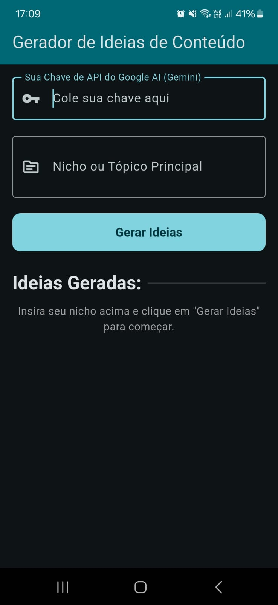

# Gerador de Ideias de Conteúdo - Samuel Thomas

## Descrição

O Gerador de Ideias de Conteúdo é um aplicativo Flutter criado para auxiliar criadores de conteúdo
na busca por inspiração. O usuário fornece um nicho ou tópico principal e sua chave de API do Google
AI (Gemini). O aplicativo então se comunica com a API do Google Generative AI para gerar 3 ideias de
conteúdo detalhadas (título, público-alvo e esboço), exibindo cada uma em um card individual com a
opção de copiar o texto gerado.

## Capturas de Tela

|              Screenshot 1               |              Screenshot 2              |              Screenshot 3              |
|:---------------------------------------:|:--------------------------------------:|:--------------------------------------:|
|  | [Exemplo 2](screenshots/example_2.jpg) | [Exemplo 3](screenshots/example_3.jpg) |

## Funcionalidades

* **Entrada de Dados:** Campos para inserir a Chave de API do Google AI (com ofuscação) e o
  Nicho/Tópico desejado.
* **Geração de Ideias:** Botão para iniciar o processo de geração de conteúdo via API do Google
  Gemini.
* **Feedback Visual:** Exibe um indicador de carregamento durante a comunicação com a API e
  mensagens de erro claras (validação de entrada, falhas na API).
* **Exibição Estruturada:** Apresenta as ideias geradas em cards separados, formatados para fácil
  leitura, mostrando Título, Público-Alvo e Esboço.
* **Parsing de JSON:** Processa a resposta JSON estruturada requisitada e retornada pela API.
* **Cópia Fácil:** Botão "Copiar" em cada card para transferir facilmente o texto formatado da ideia
  para a área de transferência.

## Tecnologias Utilizadas

* **Flutter:** Framework de UI do Google para construir aplicativos compilados nativamente.
* **Dart:** Linguagem de programação utilizada pelo Flutter.
* **`google_generative_ai`:** Pacote oficial do Google para interagir com a API Gemini (LLM).
* **`clipboard`:** Pacote para interagir com a área de transferência do sistema (funcionalidade de
  copiar).
* **`dart:convert`:** Biblioteca Dart nativa para codificação e decodificação JSON.
* **Google Generative AI (API Gemini):** Serviço de modelo de linguagem grande (LLM) utilizado para
  a geração do conteúdo (`gemini-1.5-flash-latest`).

## Instalação e Execução

Siga estas etapas para configurar e executar o projeto localmente:

1. **Pré-requisitos:**
    * Certifique-se de ter o [Flutter SDK](https://flutter.dev/docs/get-started/install) instalado (
      versão recomendada: 3.x ou superior).
    * Um editor de código como [VS Code](https://code.visualstudio.com/) (com extensões Flutter e
      Dart) ou [Android Studio](https://developer.android.com/studio).
    * Um emulador/dispositivo Android/iOS configurado ou um navegador (para execução web, se
      aplicável).
    * **Uma Chave de API do Google AI:** Obtenha sua chave gratuitamente
      no [Google AI Studio](https://aistudio.google.com/app/apikey).

2. **Clonar o repositório:**
   ```bash
   git clone https://github.com/samuelt005/atividade_avaliativa_gerador_de_ideias_para_conteudo.git
   cd <NOME_DO_DIRETORIO_DO_PROJETO>
   ```

3. **Instalar dependências:**
   Execute o seguinte comando no terminal, dentro do diretório do projeto:
   ```bash
   flutter pub get
   ```

4. **Executar o aplicativo:**
   Certifique-se de que um dispositivo, emulador ou navegador esteja pronto e execute:
   ```bash
   flutter run
   ```

5. **Uso:** Após o app iniciar, insira sua Chave de API do Google AI no campo correspondente,
   descreva o tópico desejado e clique em "Gerar Ideias". As ideias serão exibidas em cards abaixo
   do botão.

## Uso do LLM (Google Gemini)

Este aplicativo integra o modelo `gemini-1.5-flash-latest` da API Google Generative AI para fornecer
a funcionalidade principal de geração de ideias. O processo é o seguinte:

1. **Inicialização do Modelo:** Quando o usuário clica em "Gerar Ideias" (e após validações de
   entrada), uma instância do `GenerativeModel` é criada usando a chave de API fornecida pelo
   usuário (`_apiKeyController.text`).
2. **Engenharia de Prompt:** Um prompt específico é construído, instruindo o modelo a:
    * Assumir o papel de um especialista em conteúdo digital.
    * Gerar exatamente 3 ideias de conteúdo relacionadas ao tópico/nicho inserido pelo usuário (
      `_topicController.text`).
    * Formatar a resposta **estritamente** como um objeto JSON (um array/lista de objetos).
    * Garantir que cada objeto na lista contenha as chaves `titulo` (String), `publico_alvo` (
      String) e `esboco` (Lista de Strings), conforme especificado no prompt. Isso é crucial para o
      parsing correto da resposta.
3. **Requisição à API:** O prompt formatado é enviado para a API Gemini através do método
   `_model!.generateContent()`.
4. **Processamento da Resposta:** O aplicativo recebe a resposta textual da API, que deve ser uma
   string contendo o JSON solicitado.
5. **Parsing de JSON:** Utiliza a função `jsonDecode` da biblioteca `dart:convert` para analisar a
   string de resposta JSON e transformá-la em uma estrutura de dados Dart utilizável (
   `List<Map<String, dynamic>>`). O código inclui validações para tratar possíveis erros de
   formatação na resposta da API.
6. **Exibição na UI:** Os dados parseados (lista de ideias) são usados para construir dinamicamente
   os widgets `Card` na interface, mostrando cada ideia de forma organizada e adicionando a
   funcionalidade de cópia.
